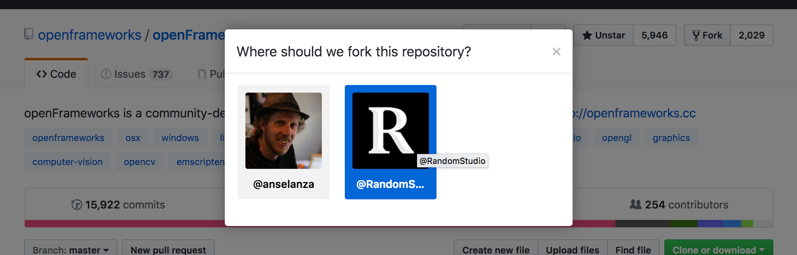

# RSOSS
> Randomly Open Sourcing
*or*
> How to do Open Source, the Random Way 😉

Some guidelines and best practices.

**IMPORTANT DISCLAIMER: THIS DOCUMENT IS A DRAFT (WORK IN PROGRESS) AND DOES NOT CURRENTLY SIGNIFY OFFICIAL COMPANY POLICY. IT IS AN EXPLORATION OF POLICIES AND BEST PRACTICES UNDER DEVELOPMENT.**

## The Why Part
We need to build our public profile in the Open Source software development universe, which is after all the same universe where all the good developers are - the ones who work for us or who might work for us in the future! So, yes, it's part of **employer branding**.

By improving and contributing to the tools and frameworks that make our work possible, we demonstrate that we are good Open Source citizens (givers and not just takers). Call it **Open Source virtue-signalling**.

Our involvement in the works of others (the list of repos we contribute to) is also a very good **advertisement of the stuff we're interested in and the technologies in which we have expertise**.

Last but not least, there is the potential to **harness the power of the crowd**: outsiders may end up improving (and QA'ing) things that we originally built by ourselves for ourselves.

## Forking public repos (not our own)
When forking a project to improve/contribute, members (with repo create privileges) should see the option to fork either to their private account or to the Organization:

If this is a work-related project (it is being done on company time and/or is being used in the process of client projects), then it is a good candidate to be forked under the Org.

## Brand new repos
When we create something that is useful to us and potentially useful to others, this should be created under the Random Studio Org (or transferred there if necessary). 

> TODO: How to manage conflicts of interest, legal IP issues, etc.

## Who gets the credit?
It is important to remember that even when a repo is "owned" by the Org (it was started under the Random Studio Org or ownership was transferred), all commit activity is attributed to the individual **users**.

This is a good thing:
* Users get credit for their work publicly (it shows up on their GitHub profile under their activity)
* However, the repos owned by the Org do not show up under each user's list of repositories, on their GitHub profiles
* We can track who is responsible for what
* We can also allow outsiders to contribute (in a controlled way) to anything we're working on

## Useful resources and references
* GitHub's own [Open Source Guide](https://opensource.guide/): includes tips on growing community and some info on the legal side of Open Source
* [Why the Best Companies and Developers Give Away Almost Everything They Do](https://blog.ycombinator.com/why-the-best-give-away/) goes into some of the non-altruistic reasons why Open Source is good for companies
* [What Microsoft understands about open source that your company does not](https://www.techrepublic.com/article/what-microsoft-understands-about-open-source-that-your-company-does-not/): "Microsoft understands that its future depends upon contributing to open source, not just using it. Here's why your company needs the same strategy. "
